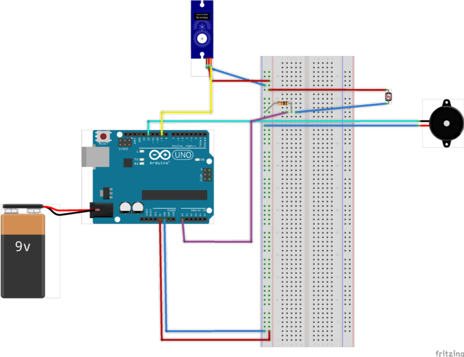

# Pet-like plant using arduino
Designing an interactive physical object that is in conversation with an issue using Arduino as a microcontroller-based prototyping platform.

In this project we were questioning the relationship between a plant and its human caretaker, making the human attend to the plant on an equal footing. Thus,
we aimed to create a stronger bond between plants and humans. We believed that by giving plants abilities to communicate by sound and motion humans would recognise them as living beings.

## Sensors and actuators
- 1 x light sensor
- 1 x piezo buzzer
- 1 x step motor

## Interaction attributes
- slow
- stepwise
- delayed

## Credits
This project was done during a specialization course in Designing Interactions at the IT University in Copenhagen (2019) in collaboration with Asbjørn Mejlvang, Gerd Geleff Nielsen and Simon Skjoldmose Hansen.
